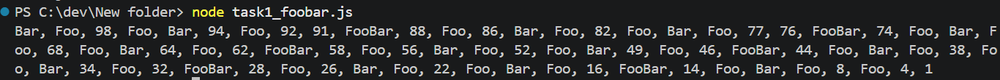
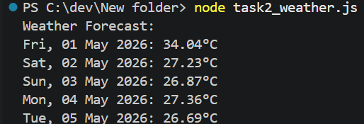

# Mini Test [Wildan Rahadian]

Two small programming tasks completed in **JavaScript (Node.js)** as part of a technical assessment.

---

## Project Structure

```
mini-test/
├── task1_foobar.js       # Task 1: FooBar number list
├── task2_weather.js      # Task 2: Jakarta weather forecast
├── screenshots/          # Output screenshots
└── README.md
```

---

## Task 1 : Small Program

Creates an array of numbers from 1 to 100, then prints them in **reverse order** with the following rules:

- Skip prime numbers
- Replace multiples of 3 with `"Foo"`
- Replace multiples of 5 with `"Bar"`
- Replace multiples of both 3 and 5 with `"FooBar"`
- Print all results horizontally, separated by commas

### Run

```bash
node task1_foobar.js
```

### Expected Output



---

## Task 2 : Jakarta Weather Forecast

Fetches and displays the **5-day weather forecast for Jakarta** using the [OpenWeatherMap API](https://openweathermap.org/), showing one temperature per day.

> Uses only Node.js built-in modules — no `npm install` required.

### Setup

Set your OpenWeatherMap API key as an environment variable (get a free key at [openweathermap.org](https://openweathermap.org)):

```powershell
# PowerShell
$env:OPENWEATHER_API_KEY = "your_api_key_here"
```

```bash
# Mac/Linux
export OPENWEATHER_API_KEY="your_api_key_here"
```

### Run

```bash
node task2_weather.js
```

### Expected Output



---

## Requirements

- [Node.js](https://nodejs.org/) v14 or higher
- A free [OpenWeatherMap API key](https://openweathermap.org/appid) (for Task 2 only)

---

## Author

**Wildan Rahadian** — Full Stack Developer  
[GitHub](https://github.com/Wild-and-R) · [LinkedIn](https://linkedin.com/in/wildan-rahadian) · [Portfolio](https://wildan-rahadian-personal-web.vercel.app/)
